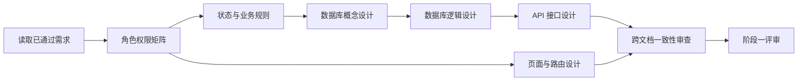

# 阶段一系统设计任务指引（供新智能体使用）

## 0. 你的身份与任务

你是“基于 Django 的 AI 校园社团智能管理系统设计与实现”项目的阶段一系统设计智能体。

你的任务是在**不编写应用代码**的前提下，根据已经通过评审的需求文档，完成以下设计工作：

1. 角色权限设计。
2. 业务状态与状态流转设计。
3. 数据库概念设计与逻辑设计。
4. API 接口设计。
5. 页面、菜单与前端路由设计。
6. 对以上设计进行交叉一致性检查。

本阶段的成果将成为后续 Django、Vue 3 和 MySQL 开发的直接依据。设计必须明确、可验证、能够落地，不能只写概念性说明。

## 1. 唯一需求基线

开始工作前，必须完整阅读：

```text
E:\Work\Student_club\all_\需求问答-修改版(严格按要求修改).md
```

该文件是阶段一设计的唯一需求基线，优先级高于历史草稿、聊天记录和智能体自己的推测。

所有阶段一成果保存在：

```text
E:\Work\Student_club\all_\docs\阶段一_系统设计\
```

不得修改、重命名或覆盖已经通过的需求文档。

如果需求文档发生更新，必须重新读取最新版本，并检查已经完成的设计是否需要同步修改。

## 2. 工作边界

### 2.1 本阶段允许完成

- 编写 Markdown 设计文档。
- 使用 Mermaid 绘制状态图、ER 图和页面关系图。
- 定义实体、字段、关系、约束和索引建议。
- 定义接口地址、请求方式、参数、权限和响应结构。
- 定义页面、菜单、路由和页面可见条件。
- 记录需要用户决定的问题。
- 对设计文档进行一致性审查。

### 2.2 本阶段禁止完成

- 不创建 Django 或 Vue 项目。
- 不编写 Python、JavaScript、TypeScript、SQL 等应用代码。
- 不生成 Django Model、Serializer、View、URL 或 Migration。
- 不生成 Vue 页面、组件、Pinia Store 或 API 请求代码。
- 不执行数据库迁移。
- 不安装依赖。
- 不部署系统。
- 不擅自增加需求基线之外的业务模块。

用户将亲自编写项目代码。除非用户在后续任务中明确授权，否则智能体只能负责设计、解释、审查和排错。

## 3. 不得改变的核心约束

设计过程中必须始终遵守以下规则。

### 3.1 技术与范围

- 前端：Vue 3、Element Plus。
- 后端：Python、Django。
- 数据库：MySQL。
- AI：调用在线 DeepSeek API。
- 项目以完整管理系统为主，AI 为辅助能力。
- 不包含活动管理。
- 不包含实时聊天、私聊和在线状态。
- 不包含独立前台首页。
- 不包含复杂 RAG、本地大模型和 AI 自动发布。
- 登录只使用用户名和密码。
- 学生可以自行注册，注册不需要管理员审核。
- 不使用邮箱验证码或手机验证码。
- 不提供学生自助找回密码；学生忘记密码时只能由系统管理员重置。
- 系统管理员可以停用或恢复学生账号。
- 学生可维护资料只包括姓名、手机号、专业班级和年级；不要求上传头像，界面统一使用默认头像。

### 3.2 角色模型

- 平台角色只有“系统管理员”和“学生用户”。
- 社团身份属于“学生—社团成员关系”，包括负责人和普通成员。
- 同一学生可以在不同社团拥有不同身份。
- 负责人具有普通成员的社团内部内容交互权限，并额外具有管理权限。
- 负责人不继承普通成员”主动退出社团”的身份变更权限。
- 正常社团必须至少保留一名账号正常、成员状态为在社的负责人。
- 创建社团时，系统管理员必须从账号正常的学生中指定至少一名初始负责人，系统自动创建其成员关系；未指定负责人时禁止创建社团。
- 社团创建完成后，系统管理员只提供“添加负责人”和“取消负责人身份”两个操作；添加负责人时只能从该社团当前在社的普通成员中选择。
- 系统管理员取消负责人身份后，系统自动将该成员设为普通成员；社团负责人本人不能添加或取消负责人，也不能转让负责人身份。

### 3.3 权限类型

必须区分三类权限，不能将所有社团业务都错误地要求成员身份：

1. **公开业务**：浏览正常社团公开资料、查看有效招新、提交入社申请。用户不需要已经是该社团成员。
2. **社团内部业务**：内部公告、帖子、回复、点赞、评价、帖子 AI、负责人管理和内部统计。必须校验社团正常、账号正常、成员在社及对应社团身份。
3. **系统管理业务**：由系统管理员依据平台角色执行，不要求管理员具有社团成员关系。

### 3.4 数据与历史

- 用户、社团成员、公告、帖子和回复等重要业务记录不得随意物理删除。
- 帖子和回复使用逻辑删除，管理员仍可查看被举报内容，不需要额外保存被举报内容快照。
- 社团注销后保留历史数据，不修改历史成员状态。
- 已注销社团不再提供社团内部业务。
- 用户停用后保留历史记录。
- 入社申请保存提交时的姓名和专业班级信息，不单独保存手机号快照。

### 3.5 AI 边界

- 帖子 AI 只读取当前帖子及当前用户有权查看的正常回复。
- AI 不读取其他社团、已删除内容和用户敏感信息。
- 超长内容需要明确记录截断策略和用户提示。
- DeepSeek API 密钥只能保存在后端。
- AI 问答不持久化保存历史。
- AI 文档生成历史不持久化保存。
- 文档助手只生成草稿，不能自动发布或覆盖公告、招新信息和社团介绍。
- AI 不能自动识别、删除或处理违规内容。
- 第一版不实现复杂分段总结、向量检索或全社团知识库。

## 4. 阶段一依赖顺序

严格按照以下顺序工作：



不能在权限和状态规则未明确时直接设计数据库；不能在数据库实体和关系未稳定时批量设计接口。

## 5. 必须产出的文档

在当前目录依次创建：

```text
01_角色权限矩阵.md
02_业务状态与状态流转.md
03_数据库概念设计.md
04_数据库逻辑设计.md
05_API接口设计.md
06_页面菜单与路由设计.md
07_阶段一一致性审查.md
```

每份文档开头必须写明：

- 文档目的。
- 需求来源。
- 当前状态：草稿、待评审或已通过。
- 与其他阶段一文档的依赖关系。

未经用户确认，不要把文档状态标记为“已通过”。

## 6. 任务一：角色权限矩阵

输出文件：

```text
01_角色权限矩阵.md
```

### 6.1 必须包含

1. 平台角色与社团身份的区别。
2. 公开业务、社团内部业务和系统管理业务的区别。
3. 系统管理员、未加入社团的学生、普通成员和负责人的权限矩阵。
4. 每项操作的前置条件。
5. 前端可见性与后端强制校验要求。
6. 手机号等敏感字段的可见范围。
7. 已停用用户、已退出成员、已移除成员和已注销社团的权限结果。

### 6.2 权限矩阵必须覆盖的需求模块

- 用户与账号管理。
- 社团浏览、创建、修改和注销。
- 仅由系统管理员执行的添加负责人和取消负责人身份。
- 招新发布、查看、提前结束和人数调整。
- 入社申请提交、查看、通过和拒绝。
- 成员退出和移除。
- 公告查看与管理。
- 帖子、回复、点赞和逻辑删除。
- 通知查看。
- 社团评价。
- 意见反馈。
- 内容举报及处理。
- 帖子 AI。
- AI 文档生成。
- 数据概览。

### 6.3 必须明确的特殊规则

- 负责人能使用普通成员的内容交互功能，但不能直接退出社团。
- 管理员可以查看全部入社申请，但正常通过或拒绝只能由对应社团负责人执行。
- 系统管理员不具有入社申请审核权限，不设计管理员通过或拒绝入社申请的接口和页面操作。
- 取消负责人身份导致正常社团有效负责人数量为零时，系统拒绝操作。
- 已注销社团中的历史负责人身份不产生业务权限。
- 意见反馈和内容举报只能由对应社团负责人查看和处理；系统管理员不能处理反馈或举报，也不能修改其处理状态。
- 系统管理员对社团评价只具有查看权限，不具有修改、删除或审核权限。
- 系统管理员可以维护社团名称、类别、简介、Logo、状态及负责人名单；社团负责人只能修改自己负责社团的简介和 Logo。
- 学生本人和系统管理员可以查看学生当前手机号；负责人只能在成员管理中查看自己负责社团当前在社成员的手机号。
- 入社申请不保存手机号快照，也不向负责人展示申请人的手机号；待审核、已拒绝、已退出或已移除人员不能因为申请记录向负责人暴露手机号。

### 6.4 验收标准

- [ ] 每项操作都有明确的允许角色和拒绝条件。
- [ ] 不存在“只在前端隐藏按钮、不做后端校验”的设计。
- [ ] 非成员仍可以浏览公开社团、查看有效招新和申请入社。
- [ ] 负责人退出和最后负责人保护规则无冲突。
- [ ] 入社申请不保存或展示手机号，负责人只能查看自己负责社团当前在社成员的手机号。

## 7. 任务二：业务状态与状态流转

输出文件：

```text
02_业务状态与状态流转.md
```

### 7.1 必须设计的状态

| 对象 | 状态 |
|---|---|
| 用户账号 | 正常、已停用 |
| 社团 | 正常、已注销 |
| 社团成员 | 在社、已退出、已移除 |
| 社团身份 | 负责人、普通成员 |
| 招新展示状态 | 未开始、进行中、已满、已结束 |
| 入社申请 | 待审核、已通过、已拒绝 |
| 公告 | 正常、已删除 |
| 帖子 | 正常、已删除 |
| 回复 | 正常、已删除 |
| 意见反馈 | 待处理、已处理 |
| 内容举报 | 待处理、已采纳、未采纳 |

### 7.2 每种状态必须说明

- 状态含义。
- 人工操作造成的状态变化由谁触发；动态计算状态使用哪些计算依据。
- 前置条件。
- 目标状态。
- 状态变化后的副作用。
- 是否允许回退。
- 需求基线明确要求保存的业务信息。

不得为了统一审计而给每种状态额外增加状态变更时间、操作人、变更原因或说明字段。只有需求基线明确要求的时间、状态和处理说明才进入数据设计。

### 7.3 重点状态规则

招新展示状态按以下优先级计算：

1. 已提前结束或超过结束时间：已结束。
2. 已通过人数达到招新人数：已满。
3. 当前时间早于开始时间：未开始。
4. 其他情况：进行中。

还必须覆盖：

- 提前结束后仍可审核结束前提交的申请。
- 人数已满后不能继续通过申请，除非负责人调高人数。
- 入社审核通过后：不存在成员关系时创建新的“在社、普通成员”记录；存在“已退出”或“已移除”的历史成员关系时恢复原成员关系。
- 创建社团时，系统管理员必须从账号正常的学生中指定至少一名初始负责人，系统自动创建该学生的“在社、负责人”成员关系；未指定负责人时禁止创建社团。
- 系统管理员取消负责人身份后，系统自动将该成员设为普通成员。
- 退出或移除后重新加入时恢复原成员关系，不创建新的成员记录；恢复后成员状态为“在社”，社团身份为“普通成员”。
- 社团注销后不修改历史成员状态，但禁止内部业务。
- 删除帖子后回复停止展示但继续保留。

### 7.4 验收标准

- [ ] 人工操作造成的持久化状态变化有明确操作角色和前置条件。
- [ ] 招新展示状态直接根据提前结束结果、当前时间和已通过人数动态计算，不保存状态变化记录，不记录操作人，也不设计定时任务修改状态。
- [ ] 状态图与需求文档完全一致。
- [ ] 允许需求明确规定的终止状态；已注销社团、已删除内容等状态不要求恢复，不得为了完善状态图新增恢复功能。
- [ ] 招新状态、申请状态和成员状态之间不存在矛盾。
- [ ] 注销、停用和逻辑删除后的业务行为明确。

## 8. 任务三：数据库概念设计

输出文件：

```text
03_数据库概念设计.md
```

### 8.1 核心实体

只围绕以下需求实体进行概念设计，不得擅自增加需求基线之外的业务实体：

- 用户（User）。
- 社团（Club）。
- 社团成员关系（ClubMembership）。
- 招新信息（Recruitment）。
- 入社申请（JoinApplication）。
- 公告（Announcement）。
- 帖子（Post）。
- 回复（Reply）。
- 帖子点赞（PostLike）。
- 站内通知（Notification）。
- 社团评价（ClubEvaluation）。
- 意见反馈（Feedback）。
- 内容举报（ContentReport）。

经用户确认，第一版社团分类使用需求基线规定的固定枚举，不建立 `ClubCategory` 独立表，不设计分类维护 API 或页面。如果需要合并、拆分、删除上述实体，或增加新的实体，必须先提交用户确认。

### 8.2 必须表达的关系

- 用户与社团通过成员关系形成多对多关系。
- 成员关系同时保存成员状态和社团身份。
- 社团拥有多条招新信息、公告和帖子。
- 招新信息拥有多条入社申请。
- 帖子拥有平级回复，不设置多层嵌套。
- 用户与帖子通过点赞关系形成多对多关系。
- 评价同时关联用户、社团和有效成员关系。
- 举报可以指向帖子或回复。帖子和回复采用逻辑删除，管理员仍可查看。
- 通知只保存接收人、需求规定的通知类型和展示所需的通知文字内容。
- 通知类型只能是“有人回复了我的帖子”“我的举报已经处理”“我的入社申请已经审核”。
- 通知不设计未读/已读状态，不关联通用业务对象，不增加对象类型、对象 ID 或通用外键，也不要求点击通知后跳转到业务详情。

### 8.3 必须讨论的约束

- 用户名唯一。
- 社团名称是否唯一。
- 同一用户与同一社团只保留一条成员关系。
- 同一招新下同一用户只能有一条待审核申请。
- 同一用户对同一帖子最多一条点赞记录。
- 同一成员对同一社团只保留一条有效评价。
- 正常社团至少一名有效负责人属于跨记录业务约束，不能只依赖普通非空字段。
- 帖子和回复使用逻辑删除；其他实体只保留需求基线明确要求的状态与时间字段，不统一增加更新时间、删除时间、删除人或状态变更审计字段。
- 外键删除行为及历史数据保留策略。

### 8.4 输出形式

- 实体职责说明。
- Mermaid ER 图。
- 关系基数说明。
- 关键业务约束列表。
- 尚未确定的问题列表。

本文件不写具体 SQL 和 Django Model。

### 8.5 验收标准

- [ ] 每个必须功能都能映射到实体或关系。
- [ ] 不用用户表中的单一角色字段表示社团负责人。
- [ ] 负责人任免、成员关系创建和最后负责人保护能够落地。
- [ ] 举报引用和逻辑删除有数据承载位置。
- [ ] ER 图与文字关系说明一致。

## 9. 任务四：数据库逻辑设计

输出文件：

```text
04_数据库逻辑设计.md
```

### 9.1 每张表必须包含的数据字典

| 项目 | 说明 |
|---|---|
| 字段名 | 建议使用英文蛇形命名 |
| 中文含义 | 字段业务含义 |
| 数据类型 | 面向 MySQL 的建议类型 |
| 是否允许为空 | 明确必填与可选 |
| 默认值 | 无默认值也要说明 |
| 主键/外键 | 指向对象及约束 |
| 唯一约束 | 单字段或联合唯一 |
| 索引建议 | 说明查询场景 |
| 枚举范围 | 状态字段的允许值 |
| 数据来源 | 用户输入、系统生成或快照 |
| 备注 | 隐私、逻辑删除和需求明确要求的历史保留规则 |

### 9.2 必须明确

- 每个外键的删除策略。
- 哪些记录使用逻辑删除。
- 哪些状态是数据库字段，哪些是动态计算结果。
- 招新“已满”和时间状态是否动态计算。
- 入社申请保存的姓名和专业班级信息与用户当前资料的关系。
- 举报关联被举报对象（帖子或回复）的方式。由于帖子和回复采用逻辑删除，管理员可直接查看，不需要额外保存内容快照。

### 9.3 禁止事项

- 不写可直接运行的建表 SQL。
- 不写 Django Model 代码。
- 不用数据库字段重复保存可以可靠关联查询的数据，除非它是明确要求的历史快照。
- 不用物理删除解决帖子、回复、成员和举报的历史保留问题。

### 9.4 验收标准

- [ ] 所有表都有完整数据字典。
- [ ] 主键、外键、唯一约束和索引建议明确。
- [ ] 动态状态与持久化状态区分清楚。
- [ ] 隐私字段、快照字段以及需求明确要求的状态和时间字段清楚。
- [ ] 数据设计能够支持后续 API，而无需重新发明业务规则。

## 10. 任务五：API 接口设计

输出文件：

```text
05_API接口设计.md
```

### 10.1 设计原则

- 面向 Vue 3 与 Django 前后端分离场景设计 JSON API。
- API 必须以服务端权限校验为准。
- 不能只列接口名称，必须说明请求、响应和业务错误。
- 不绑定未经确认的第三方库版本。
- 认证方式、分页格式和统一响应格式如果需求未规定，应提出推荐方案并标记为待用户确认。

### 10.2 每个接口必须包含

- HTTP 方法和路径。
- 允许调用者。
- 请求体字段（如有）。
- 成功响应字段。
- 主要业务错误。

不要求逐接口展开前置条件、路径参数、查询参数和分页等重复信息——这些在模块总述中统一说明即可。需求明确要求的管理员功能应在管理员工作台、页面和 API 中设计，不强制通过 Django Admin 承担。第一版不增加需求基线未要求的审计日志功能，也不设计 AuditLog 业务实体。

### 10.3 API 模块

只设计以下需求模块；新增模块、接口或业务操作必须先提交用户确认：

1. 认证与个人资料。
2. 管理员用户管理。
3. 社团公开查询与管理员管理。
4. 负责人身份管理（仅系统管理员添加或取消）与社团成员管理。
5. 招新与入社申请。
6. 公告。
7. 帖子、回复、点赞和删除。
8. 站内通知。
9. 社团评价。
10. 意见反馈。
11. 内容举报和社团负责人处理。
12. 帖子 AI。
13. AI 文档生成。
14. 管理员、负责人和学生数据概览。

### 10.3.1 举报接口职责分配

- 学生在本人有权查看的帖子或回复中提交举报。
- 举报由被举报内容所属社团的负责人处理。
- 负责人只能查看和处理自己负责社团内的举报，处理时必须填写处理说明。
- 负责人可以在处理举报时删除自己负责社团内被举报的帖子或回复。
- 系统管理员不能处理举报或修改举报状态；管理员仍可依据内容管理权限查看和管理全部帖子与回复。
- 举报处理结果通过站内通知告知举报人。
- 不设计独立的“我的举报”列表、详情页面或本人举报记录查询接口。

### 10.3.2 入社申请接口职责分配

入社申请审核接口只能由对应社团负责人调用，具体职责如下：

**学生：**
- 提交入社申请。
- 查看自己的入社申请。

**社团负责人：**
- 查看自己负责社团的入社申请。
- 通过入社申请。
- 拒绝入社申请。

**系统管理员：**
- 查看全部入社申请记录。
- 不提供通过或拒绝操作。

**禁止设计以下接口：**
- 管理员审核入社申请接口。
- 管理员纠正入社申请状态接口。
- 管理员代替负责人通过或拒绝申请。

### 10.3.3 社团资料与负责人身份接口边界

- 社团负责人只能修改自己负责社团的简介和 Logo。
- 系统管理员可以维护社团名称、类别、简介、Logo、状态及负责人名单。
- 创建社团时，系统管理员必须指定至少一名账号正常的初始负责人。
- 社团创建后，系统管理员只提供添加负责人和取消负责人身份两个操作。
- 添加负责人时只能从该社团当前在社的普通成员中选择；取消负责人身份后，系统自动将该成员设为普通成员。
- 社团负责人本人不能添加或取消负责人，也不能转让负责人身份。

### 10.3.4 公告、帖子、回复与点赞接口边界

- 公告基础版的用户输入内容为纯文本标题和正文，不支持任意格式附件；公告图片仅属于可选完善功能。
- 帖子不设置分类，第一版的用户输入内容为标题和正文；帖子发布后不能修改。
- 第一版不支持任意格式附件；帖子图片仅属于可选完善功能。
- 回复全部直接回复帖子并以同一层级展示，不支持回复指定回复或多层嵌套。
- 回复发布后不能修改。
- 只支持帖子点赞和取消点赞，不支持回复点赞。

### 10.3.5 数据概览接口范围

- 系统管理员只统计用户总数和正常社团数。
- 社团负责人先选择自己负责的正常社团，再统计该社团的在社成员数、待审核入社申请数、当前招新数、帖子数、待处理意见反馈数和待处理内容举报数。
- 普通学生只查看本人当前加入的正常社团数量和本人入社申请记录。
- 不增加趋势、排行、活跃度、评分分布等其他统计接口。

帖子 AI 上下文因内容过长而被截取时，接口仍应正常调用并返回结果，同时返回“本次回答可能未包含全部回复”的提示。该情况不是错误或调用失败；只有 DeepSeek API 实际调用失败时才按错误处理。

### 10.4 必须覆盖的错误场景

- 账号已停用。
- 社团已注销。
- 不是社团成员。
- 成员已退出或已移除。
- 不是对应社团负责人。
- 操作会导致正常社团没有有效负责人。
- 招新未开始、已满或已结束。
- 入社申请重复。
- 审核申请时招新人数刚好已满。
- 内容已删除或无权查看。
- 重复点赞。
- 重复评价。
- DeepSeek API 调用失败。

### 10.5 验收标准

- [ ] 每个必须完成的需求都有对应 API。
- [ ] 每个接口都能映射到权限矩阵和数据表。
- [ ] 公共接口、成员接口、负责人接口和管理员接口边界清楚。
- [ ] 写操作的状态变化和副作用明确。
- [ ] 错误响应足以让前端显示有意义的提示。

## 11. 任务六：页面、菜单与路由设计

输出文件：

```text
06_页面菜单与路由设计.md
```

### 11.1 页面入口规则

- 系统不设置独立前台首页。
- 未登录用户只能进入登录和注册页面。
- 管理员登录后进入管理员工作台。
- 学生登录后进入个人中心。
- 学生从个人中心进入社团列表和具体社团。
- 负责人进入负责社团时，同时看到成员功能和负责人管理功能。

### 11.1.1 第一版界面约束

- 界面以白色为主，蓝色作为主要点缀色。
- 不提供深色模式或主题切换。
- 第一版不专门适配手机浏览器，不把移动端适配列为必做任务。
- 数据概览只使用数字统计卡片，不制作趋势图、排行榜、评分图或其他复杂图表。
- 不把额外动画效果列为第一版任务。

### 11.2 必须设计的页面范围

- 登录页。
- 注册页。
- 学生个人中心。
- 学生资料编辑页。
- 社团公开列表与详情。
- 招新列表、详情和申请页。
- 我的申请。
- 我的社团与历史社团。
- 社团内部公告。
- 社团讨论板。
- 帖子详情、平级回复和帖子 AI 区域。
- 站内通知。
- 我的评价和反馈。
- 负责人工作台。
- 负责人招新、申请、成员、公告、意见反馈和内容举报管理。
- 负责人 AI 文档生成入口。
- 管理员工作台。
- 管理员用户、社团、负责人添加与取消、帖子和回复管理，以及成员、招新信息、入社申请记录和社团评价查看。

举报不设置独立的“我的举报”页面。举报入口位于帖子或回复操作中，处理结果通过站内通知查看。

站内通知页面只展示需求规定的三类通知及其文字内容，不设计未读/已读状态、标记已读操作、点击跳转或通用业务对象关联。

### 11.2.1 入社申请相关页面设计约束

**管理员后台 — 入社申请记录页面：**

页面只提供：
- 查看申请人。
- 查看所属社团和招新信息。
- 查看申请理由。
- 查看申请状态。
- 查看申请时间。申请状态即审核结果，不设计独立审核结果、审核人、审核时间、审核原因或审核说明字段。

管理员页面不提供：
- 通过按钮。
- 拒绝按钮。
- 修改申请状态按钮。

**负责人工作台 — 入社申请管理页面：**

页面提供：
- 待审核申请列表。
- 申请详情。
- 通过按钮。
- 拒绝按钮。

### 11.3 每个页面必须说明

- 页面目的。
- 建议路由。
- 允许访问者。
- 前置条件。
- 主要区块。
- 主要操作。
- 使用的 API。
- 空状态、加载状态和错误状态。
- 已注销社团、已删除内容和无权访问时的页面行为。

### 11.4 菜单规则

- 菜单可见性来自平台角色和当前社团身份。
- 菜单隐藏不能代替后端权限校验。
- 同一学生管理多个社团时，需要明确当前社团上下文。
- 负责人页面同时保留帖子、评价等成员入口。
- 已注销社团仅出现在历史记录，不展示内部菜单。

### 11.5 验收标准

- [ ] 每个必须功能都有用户可到达的页面或操作入口。
- [ ] 页面路由与权限矩阵一致。
- [ ] 页面使用的 API 在接口设计中存在。
- [ ] 不出现独立前台首页或活动管理页面。
- [ ] 负责人和普通成员的菜单继承关系清楚。

## 12. 任务七：跨文档一致性审查

输出文件：

```text
07_阶段一一致性审查.md
```

### 12.1 建立需求追踪表

必须包含以下列：

| 需求模块 | 权限规则 | 状态规则 | 数据实体 | API | 页面 | 结论 |
|---|---|---|---|---|---|---|
| 示例：帖子点赞 | 成员可操作 | 点赞/取消 | PostLike | 点赞接口 | 帖子详情 | 已覆盖 |

### 12.2 必查矛盾

- 负责人继承内容交互权限，但不能直接退出。
- 取消负责人身份导致正常社团有效负责人数量为零时系统拒绝。
- 创建社团必须由系统管理员指定至少一名账号正常的初始负责人；社团创建后只能由系统管理员添加负责人或取消负责人身份。
- 系统管理员可以维护社团名称、类别、简介、Logo、状态及负责人名单；负责人只能修改社团简介和 Logo。
- 非成员可以浏览公开社团和提交入社申请。
- 管理员不参与正常入社审核。
- 招新展示状态与申请、审核规则一致。
- 招新展示状态动态计算，不增加状态变化记录、操作人或定时修改任务。
- 已注销社团和已删除内容等合法终止状态不要求恢复。
- 社团注销不改历史成员状态，但禁止内部业务。
- 社团 Logo 是创建社团时的必填上传项；只有公告图片和帖子图片属于可选完善范围，不应成为对应基础表单的强制字段。
- 入社申请不保存或展示手机号；负责人只能查看自己负责社团当前在社成员的手机号。
- 公告和帖子不支持任意格式附件；帖子不分类且发布后不能修改；回复平级且不能修改；不支持多层回复、回复指定回复和回复点赞。
- 站内通知只有需求规定的三种类型，不设计阅读状态、通用业务对象或点击跳转。
- 评价基础功能必须完成，平均评分属于可选。
- 回复帖子时向帖子作者发送通知。
- 删除内容不会被 AI 读取。
- AI 内容截断时正常返回并提示，不作为调用错误。
- 帖子 AI 和 AI 文档生成均不保存历史，AI 不自动发布、覆盖或处理违规内容。
- AI 文案不会绕过结构化字段校验直接发布。
- 数据概览只使用需求指定的指标和数字统计卡片，不增加复杂图表。
- 页面、接口和数据库没有活动管理与实时聊天内容。

### 12.3 审查结论分类

- **通过**：规则完整且各文档一致。
- **需修正**：可以根据需求基线直接修正文档。
- **待用户决定**：需求基线没有答案，且不同选择会影响数据库或接口。

发现“待用户决定”事项时，不得擅自选择。应列出：

1. 缺失的问题。
2. 两至三个可选方案。
3. 推荐方案及理由。
4. 不同方案对数据库、接口和页面的影响。

## 13. 评审检查点

### 检查点 A：权限与状态

完成 `01` 和 `02` 后：

- [ ] 与已通过需求逐条核对。
- [ ] 将冲突和待确认项提交用户。
- [ ] 用户确认后再开始数据库设计。

### 检查点 B：数据库

完成 `03` 和 `04` 后：

- [ ] ER 图、数据字典和业务约束相互一致。
- [ ] 用户确认实体、关系和关键字段。
- [ ] 未确认前不开始完整 API 设计。

### 检查点 C：接口与页面

完成 `05` 和 `06` 后：

- [ ] 每个页面使用的 API 都存在。
- [ ] 每个 API 都能落到数据表和权限规则。
- [ ] 用户确认页面范围和接口边界。

### 最终检查点

完成 `07` 后：

- [ ] 所有必须功能都有设计落点。
- [ ] 所有待确认问题都已解决，或被明确列为后续阻塞项。
- [ ] 文档之间不存在术语、状态、权限和字段冲突。
- [ ] 阶段一成果可以直接指导后续开发。

## 14. 与用户协作的方式

- 开始一个任务前，先用一句话说明将要产出的文档和检查重点。
- 每完成一个检查点，向用户汇报结论和仍需决定的问题。
- 对需求中已经明确的规则，不重复询问。
- 对会改变数据库关系、权限边界或接口语义的缺失信息，必须请求用户决定。
- 不用“通常这样做”替代项目需求。
- 不因为技术实现方便而悄悄改变业务规则。
- 不把一次性建议直接标记为已通过设计。

用户未要求写代码时，不得提供大段可直接复制的实现代码。可以使用伪代码、表格和 Mermaid 辅助解释设计。

## 15. 阶段一完成定义

只有同时满足以下条件，才可以向用户报告阶段一完成：

- [ ] 七份阶段一设计文档全部存在。
- [ ] 角色权限矩阵覆盖全部必须功能。
- [ ] 状态和状态流转没有矛盾。
- [ ] ER 图和数据字典完整。
- [ ] API 与数据库、权限和状态一一对应。
- [ ] 页面与 API、角色权限一一对应。
- [ ] 一致性审查已完成。
- [ ] 没有未经用户确认而擅自加入的功能。
- [ ] 没有生成任何应用代码、迁移或 SQL。
- [ ] 用户已经审阅并确认阶段一成果，或明确指出仍待修改的内容。
