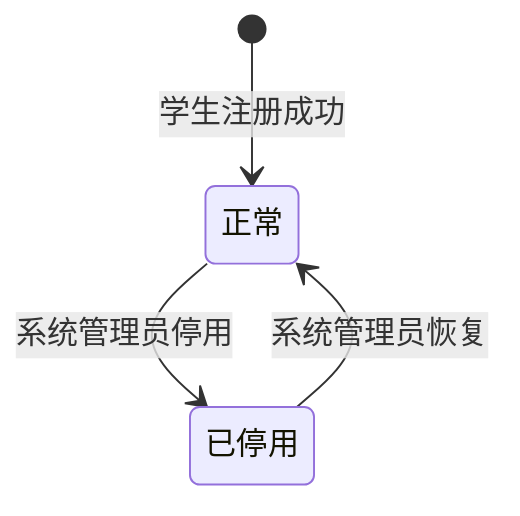
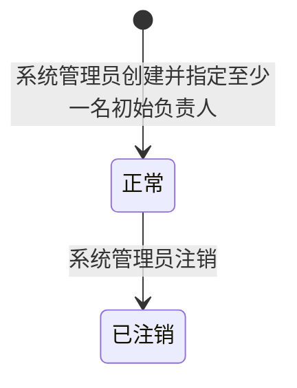
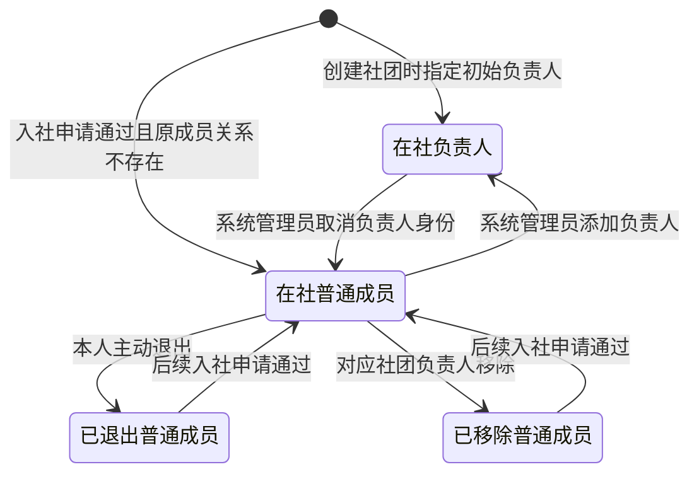
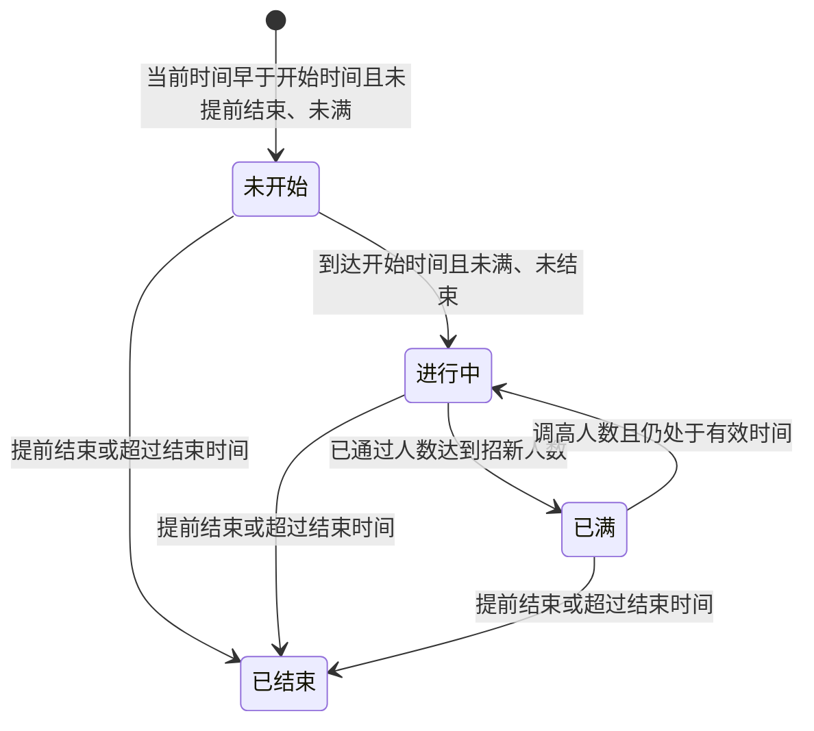
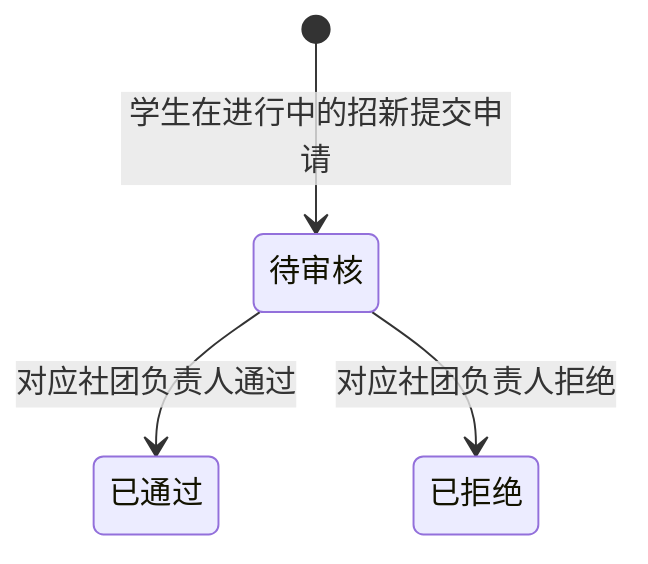
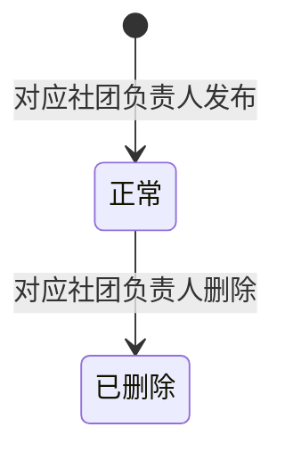
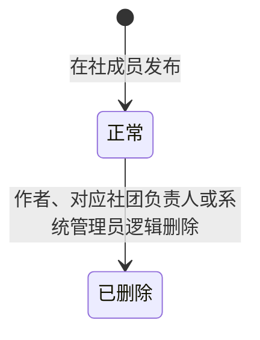
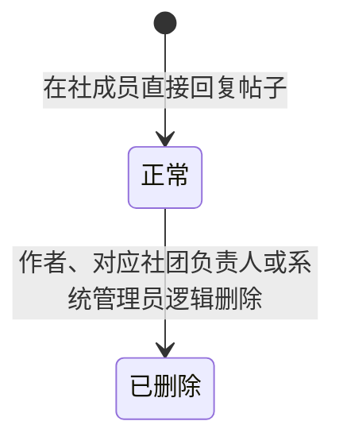
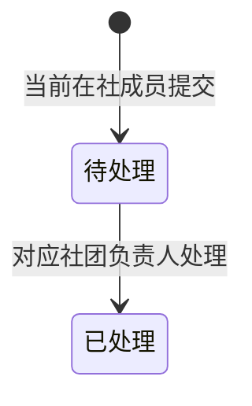
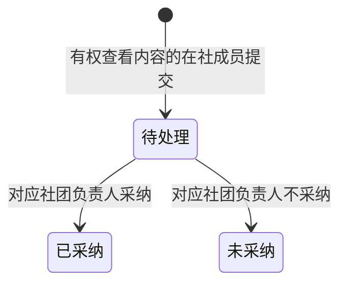

# 业务状态与状态流转

## 文档信息

- **文档目的**：定义需求范围内业务对象的状态含义、触发者、前置条件、目标状态、副作用和回退规则，作为后续数据库、API 与页面设计的状态依据。
- **唯一需求基线**：`E:\Work\Student_club\all_\需求问答-修改版(严格按要求修改).md`。
- **编写与验收依据**：`00_阶段一任务指引_供新智能体.md`。
- **权限依据**：`01_角色权限矩阵.md`。
- **当前状态**：已通过。
- **依赖关系**：本文件依赖唯一需求基线、阶段一任务指引和已通过的角色权限矩阵；后续数据库、API 和页面设计必须与本文件保持一致。

## 1. 状态设计边界

### 1.1 状态范围

本文件只设计需求明确规定的以下状态：

| 对象 | 状态或身份 | 类型 |
|---|---|---|
| 用户账号 | 正常、已停用 | 持久化状态 |
| 社团 | 正常、已注销 | 持久化状态 |
| 社团成员 | 在社、已退出、已移除 | 持久化状态 |
| 社团身份 | 负责人、普通成员 | 持久化身份 |
| 招新展示状态 | 未开始、进行中、已满、已结束 | 动态计算结果 |
| 入社申请 | 待审核、已通过、已拒绝 | 持久化状态 |
| 公告 | 正常、已删除 | 持久化状态 |
| 帖子 | 正常、已删除 | 持久化状态 |
| 回复 | 正常、已删除 | 持久化状态 |
| 意见反馈 | 待处理、已处理 | 持久化状态 |
| 内容举报 | 待处理、已采纳、未采纳 | 持久化状态 |

站内通知没有未读、已读等业务状态。第一版只保存接收人、需求规定的通知类型和展示所需的通知文字内容，不增加阅读状态、阅读时间、通用业务对象、对象类型、对象 ID 或通用外键。

### 1.2 状态与权限的共同约束

状态允许流转不代表操作者一定有权限。所有操作同时遵循 `01_角色权限矩阵.md`：

1. 学生账号必须为正常。
2. 公开业务要求目标社团正常，但不要求学生已经是该社团成员。
3. 社团内部业务要求社团正常、成员状态为在社；负责人管理操作还要求当前社团身份为负责人。
4. 系统管理业务依据系统管理员的平台角色执行，不要求管理员具有社团成员关系。
5. 任何操作都不能使正常社团失去最后一名账号正常、成员状态为在社的负责人。

### 1.3 业务信息边界

本文件只列出需求明确要求保存、或支撑明确状态所必需的业务信息，不增加统一审计字段。除需求明确规定的时间、发布人、处理说明等信息外，不额外设计状态变更时间、操作人、变更原因、删除时间、删除人、审核人、审核时间、审核原因或审核说明。

状态终止后是否保留记录，以需求规定的历史保留规则为准；“保留历史”不等于新增状态变更记录或审计实体。

## 2. 用户账号状态

### 2.1 状态含义与明确保存的信息

| 状态 | 含义 | 业务结果 |
|---|---|---|
| 正常 | 学生账号可正常使用 | 可登录，并按平台角色、社团成员状态和社团身份使用相应功能 |
| 已停用 | 系统管理员暂停学生账号使用 | 不能登录或继续使用已有会话；历史业务记录继续保留 |

需求明确的用户业务信息包括用户 ID、用户名、平台角色、账号状态、注册时间、姓名、手机号、专业班级和年级。停用或恢复不增加操作人、操作时间或操作说明字段。

### 2.2 状态图

### 2.3 流转规则

| 来源 | 目标 | 触发者 | 前置条件 | 副作用 | 是否允许回退 |
|---|---|---|---|---|---|
| 正常 | 已停用 | 系统管理员 | 目标为学生账号；停用该账号不会使任何正常社团失去最后一名有效负责人 | 账号不能继续登录或使用已有会话；成员关系、身份和历史内容均不改变 | 允许，由系统管理员恢复 |
| 已停用 | 正常 | 系统管理员 | 账号仍存在 | 恢复登录资格；具体社团权限仍按社团状态、成员状态和社团身份重新判断 | 允许再次停用 |

停用前必须检查该学生担任负责人的所有正常社团。只要其中任一社团会因此没有有效负责人，就拒绝整次停用操作。

## 3. 社团状态

### 3.1 状态含义与明确保存的信息

| 状态 | 含义 | 业务结果 |
|---|---|---|
| 正常 | 社团当前正常运营 | 可公开展示；满足其他条件时可开展公开业务和内部业务 |
| 已注销 | 社团停止运营并保留历史 | 不再公开展示或接受申请，不再提供学生端社团内部业务；系统管理员仍可查看历史记录 |

需求明确的社团业务信息包括社团 ID、名称、预设类别、简介、Logo、创建时间和社团状态。负责人名单及联系方式从用户和成员关系读取，不在社团中重复保存。注销不增加注销人、注销时间或注销原因字段。

### 3.2 状态图

### 3.3 流转规则

| 来源 | 目标 | 触发者 | 前置条件 | 副作用 | 是否允许回退 |
|---|---|---|---|---|---|
| 无 | 正常 | 系统管理员 | 填写名称、预设类别、简介并上传必填 Logo；从账号正常的学生中指定至少一名初始负责人 | 创建社团；系统同时为每名初始负责人创建“在社、负责人”成员关系；任一必要步骤失败时不得形成不含有效负责人的正常社团 | 不适用 |
| 正常 | 已注销 | 系统管理员 | 社团当前为正常 | 停止发布招新、提交新申请、发布或修改公告、发布帖子和回复、评价、帖子 AI、AI 文档生成、负责人管理和内部统计；移出学生当前社团列表；历史数据继续保留 | 第一版不允许恢复 |

社团注销不修改已有招新、入社申请、成员状态、社团身份、公告、帖子、回复、评价、反馈或举报的状态。历史负责人身份不再产生业务权限。

## 4. 社团成员状态与社团身份

### 4.1 两个维度

- 成员状态回答“学生当前是否在该社团”。
- 社团身份回答“学生在社时是负责人还是普通成员”。

只有“社团正常、账号正常、成员状态为在社”时，成员关系才产生内部权限；负责人管理权限还要求社团身份为负责人。

需求明确要求成员关系关联学生与社团，并保存成员状态和社团身份。同一学生与同一社团只保留一条成员关系。成员流转不增加加入时间、退出时间、移除时间、操作人或原因字段。

### 4.2 状态与身份含义

| 维度 | 值 | 含义 |
|---|---|---|
| 成员状态 | 在社 | 当前是该社团成员 |
| 成员状态 | 已退出 | 普通成员本人主动退出，历史关系保留 |
| 成员状态 | 已移除 | 普通成员被对应社团负责人移除，历史关系保留 |
| 社团身份 | 普通成员 | 在社时具有普通成员的内部内容交互权限，并可主动退出 |
| 社团身份 | 负责人 | 在社时继承普通成员的内容交互权限并具有负责人管理权限，但不能主动退出 |

### 4.3 组合状态图

### 4.4 流转规则

| 来源 | 目标 | 触发者 | 前置条件 | 副作用 | 是否允许回退或恢复 |
|---|---|---|---|---|---|
| 无成员关系 | 在社、负责人 | 系统管理员在创建社团时指定 | 被指定者是账号正常的学生；至少指定一人 | 创建唯一成员关系；该学生取得新社团的负责人权限 | 可由系统管理员取消负责人身份，但须满足最后负责人保护 |
| 无成员关系 | 在社、普通成员 | 对应社团负责人通过入社申请 | 申请为待审核，且通过条件全部成立 | 创建唯一成员关系；申请变为已通过 | 以后可由本人退出或由负责人移除 |
| 已退出、普通成员 | 在社、普通成员 | 对应社团负责人通过后续入社申请 | 申请为待审核，且通过条件全部成立 | 恢复原成员关系，不创建新记录；申请变为已通过 | 以后可再次退出或被移除 |
| 已移除、普通成员 | 在社、普通成员 | 对应社团负责人通过后续入社申请 | 申请为待审核，且通过条件全部成立 | 恢复原成员关系，不创建新记录；申请变为已通过 | 以后可退出或再次被移除 |
| 在社、普通成员 | 已退出、普通成员 | 普通成员本人 | 账号正常、社团正常，本人在社且身份为普通成员 | 立即失去该社团内部权限；历史内容、评价和成员关系保留 | 只能通过后续入社申请恢复 |
| 在社、普通成员 | 已移除、普通成员 | 对应社团负责人 | 操作者是该正常社团的当前有效负责人；目标为在社普通成员 | 目标立即失去该社团内部权限；历史内容、评价和成员关系保留 | 只能通过后续入社申请恢复 |
| 在社、普通成员 | 在社、负责人 | 系统管理员 | 社团正常；目标是该社团当前在社的普通成员，且账号正常 | 取得负责人管理权限，成员状态不变 | 可由系统管理员取消负责人身份 |
| 在社、负责人 | 在社、普通成员 | 系统管理员 | 操作后该正常社团仍至少有一名有效负责人 | 立即失去负责人管理权限，仍保留普通成员权限 | 可再次由系统管理员添加为负责人 |

社团创建完成后，系统管理员不能把非成员、已退出成员或已移除成员直接设为负责人，只能从该社团当前在社的普通成员中选择。负责人需要离开社团时，必须先由系统管理员取消其负责人身份；成为普通成员后，由本人主动退出，或由该社团其他有效负责人移除。

以下流转禁止：

- 负责人直接主动退出；
- 负责人移除其他负责人；
- 系统管理员直接移除普通成员；
- 负责人自行添加、取消或转让负责人身份；
- 任何导致正常社团有效负责人数量变为零的操作。

社团注销时不改变成员状态或身份，因此历史上可以保留“在社、负责人”等组合，但这些组合不再产生内部权限。

## 5. 招新展示状态

### 5.1 状态性质与计算依据

“未开始、进行中、已满、已结束”是服务端动态计算的展示结果，不保存为可独立修改的展示状态，不设计定时任务修改状态，也不保存状态变化记录或状态操作人。

动态计算只使用需求明确的依据：

- 是否已经被负责人提前结束；
- 开始时间；
- 结束时间；
- 招新人数；
- 当前招新下状态为“已通过”的申请数量；
- 服务端当前时间。

需求明确的招新业务信息包括标题、简介、要求、人数、开始时间、结束时间、发布社团、发布人和发布时间。提前结束结果仅用于判断“已结束”，不附加提前结束操作人、操作时间或原因。

### 5.2 固定计算优先级

服务端按以下顺序判断，命中第一项后停止：

1. 已被负责人提前结束，或服务端当前时间已经超过结束时间：**已结束**。
2. 当前招新下已通过人数大于或等于招新人数：**已满**。
3. 服务端当前时间早于开始时间：**未开始**。
4. 其他情况：**进行中**。

“已结束”的优先级高于“已满”。前端不得自行使用另一套顺序计算。

### 5.3 动态状态图

### 5.4 状态行为

| 展示状态 | 提交新申请 | 审核已有待审核申请 | 负责人可执行的操作 |
|---|---:|---:|---|
| 未开始 | 禁止 | 正常情况下没有该招新产生的待审核申请 | 修改尚未结束的招新、提前结束 |
| 进行中 | 允许 | 允许通过或拒绝 | 修改、调整人数、提前结束、审核申请 |
| 已满 | 禁止 | 不允许继续通过；允许拒绝；调高人数后可再次通过 | 调高人数、拒绝待审核申请、提前结束 |
| 已结束 | 禁止 | 允许继续审核结束前已提交的待审核申请；通过前仍须检查人数 | 查看历史、审核已有待审核申请 |

调整后的人数不能小于当前已通过人数。招新已满后，负责人可以调高人数；如果尚未提前结束且当前时间尚未超过结束时间，展示状态可重新变为进行中。招新结束后不再修改招新内容或人数，也不提供恢复或重新开启功能；需要再次招新时发布新的招新信息。

## 6. 入社申请状态

### 6.1 状态含义与明确保存的信息

| 状态 | 含义 | 是否终止状态 |
|---|---|---:|
| 待审核 | 学生已提交申请，等待对应社团负责人处理 | 否 |
| 已通过 | 对应社团负责人同意申请，成员关系已创建或恢复 | 是 |
| 已拒绝 | 对应社团负责人拒绝本次申请 | 是 |

需求明确要求保存申请人用户 ID、提交时的姓名、提交时的专业班级、申请的社团、招新信息、申请理由、申请时间和申请状态。不保存手机号快照，也不增加审核人、审核时间、审核原因、审核说明或独立审核结果字段；申请状态本身就是审核结果。

### 6.2 状态图

第一版不提供申请撤回、管理员代审、管理员修改状态、撤销审核或重新打开同一申请。

### 6.3 创建“待审核”申请

提交申请必须同时满足：

1. 申请人已登录且账号正常；
2. 目标社团正常；
3. 招新动态展示状态为进行中；
4. 申请人当前不是该社团的在社成员；
5. 同一招新下，该学生不存在另一条待审核申请；
6. 学生填写的申请理由符合基础输入要求。

系统从当前用户和当前招新上下文读取其他信息。姓名和专业班级按提交时的用户资料保存，之后不随用户资料修改而改变；学生不能手动修改这些自动取得的信息。

### 6.4 审核流转

| 来源 | 目标 | 触发者 | 前置条件 | 副作用 | 是否允许回退 |
|---|---|---|---|---|---|
| 待审核 | 已通过 | 对应社团当前有效负责人 | 社团正常；申请仍为待审核；申请人账号正常且当前不在社；当前已通过人数小于招新人数 | 不存在成员关系时创建“在社、普通成员”关系；存在已退出或已移除历史关系时恢复原关系为“在社、普通成员”；生成“我的入社申请已经审核”通知 | 不允许 |
| 待审核 | 已拒绝 | 对应社团当前有效负责人 | 社团正常；申请仍为待审核 | 不改变成员关系；生成“我的入社申请已经审核”通知 | 不允许 |

通过申请时，容量检查、申请状态变化和成员关系创建或恢复必须作为同一业务操作完成，避免超过招新人数。若通过条件不成立，申请状态不得变为已通过。

招新提前结束或超过结束时间，不自动拒绝已经提交的待审核申请；负责人仍可处理这些申请。人数已满时，只能拒绝其余申请，或先调高人数再通过。被拒绝的学生只能在该社团后续发布的新招新信息中重新申请。

系统管理员只能查看全部入社申请记录，不能通过、拒绝或修改申请状态。

## 7. 公告状态

### 7.1 状态含义与明确保存的信息

| 状态 | 含义 | 业务结果 |
|---|---|---|
| 正常 | 公告可供本社团当前在社成员查看 | 对应负责人可按权限修改、置顶或删除 |
| 已删除 | 公告已被对应社团负责人删除 | 不再向普通成员展示，历史记录保留 |

需求明确的公告业务信息包括标题、正文、发布社团、发布人、发布时间、是否置顶和公告状态。删除不增加删除人、删除时间或删除原因字段。

### 7.2 状态图与流转

| 来源 | 目标 | 触发者 | 前置条件 | 副作用 | 是否允许回退 |
|---|---|---|---|---|---|
| 无 | 正常 | 对应社团负责人 | 账号正常、社团正常、成员在社、身份为负责人；纯文本标题和正文符合要求 | 保存需求明确的公告信息 | 不适用 |
| 正常 | 已删除 | 对应社团负责人 | 公告属于本人负责的正常社团且当前为正常 | 普通成员不再看到该公告；记录继续保留 | 第一版不允许恢复 |

修改公告内容、置顶或取消置顶不改变公告状态。社团注销不把公告批量改为已删除，而是通过社团状态禁止学生访问和修改。

## 8. 帖子状态

### 8.1 状态含义与明确保存的信息

| 状态 | 含义 | 业务结果 |
|---|---|---|
| 正常 | 帖子可供本社团当前在社成员查看和回复 | 符合权限的成员可交互，帖子 AI 可读取 |
| 已删除 | 帖子已被逻辑删除 | 普通成员不可见；其回复停止展示；帖子 AI 不读取；历史数据保留 |

第一版帖子只包含需求规定的标题、正文及支撑所属社团、作者、置顶和逻辑删除所需的信息；标题必填且最多 255 字，正文必填且最多 5000 字。不增加帖子分类、修改信息、任意附件或删除审计字段。帖子发布后不能修改。

### 8.2 状态图与流转

| 来源 | 目标 | 触发者 | 前置条件 | 副作用 | 是否允许回退 |
|---|---|---|---|---|---|
| 无 | 正常 | 普通成员或负责人 | 账号正常、社团正常、成员在社；标题和正文符合要求 | 帖子可供本社团在社成员查看 | 不适用 |
| 正常 | 已删除 | 当前仍有该社团内部权限的作者 | 帖子由本人发布且当前为正常 | 普通成员不可见；全部回复停止展示但各回复自身状态不变；帖子 AI 不再读取 | 第一版不允许恢复 |
| 正常 | 已删除 | 对应社团负责人 | 帖子属于本人负责的正常社团且当前为正常 | 同上 | 第一版不允许恢复 |
| 正常 | 已删除 | 系统管理员 | 目标帖子当前为正常 | 同上；帖子历史仍可由管理员查看 | 第一版不允许恢复 |

置顶或取消置顶不改变帖子状态。已退出、已移除或账号已停用的作者不能返回原社团删除以前发布的帖子。

## 9. 回复状态

### 9.1 状态含义与明确保存的信息

| 状态 | 含义 | 业务结果 |
|---|---|---|
| 正常 | 回复可随正常帖子向本社团当前在社成员展示 | 帖子 AI 在当前用户有权查看时可读取 |
| 已删除 | 回复已被逻辑删除 | 普通成员不可见；帖子 AI 不读取；历史数据保留 |

第一版回复只直接关联帖子并平级展示，不关联目标回复，不支持多层嵌套、修改或点赞。回复内容必填且最多 1000 字；只保存回复内容及支撑所属帖子、作者和逻辑删除所需的信息，不增加删除审计字段。

### 9.2 状态图与流转

| 来源 | 目标 | 触发者 | 前置条件 | 副作用 | 是否允许回退 |
|---|---|---|---|---|---|
| 无 | 正常 | 普通成员或负责人 | 账号正常、社团正常、成员在社；父帖子正常且对本人可见 | 回复平级展示；向帖子作者生成“有人回复了我的帖子”通知 | 不适用 |
| 正常 | 已删除 | 当前仍有该社团内部权限的作者 | 回复由本人发布且父帖子仍可访问 | 普通成员不可见；帖子 AI 不再读取 | 第一版不允许恢复 |
| 正常 | 已删除 | 对应社团负责人 | 回复属于本人负责的正常社团且当前为正常 | 同上 | 第一版不允许恢复 |
| 正常 | 已删除 | 系统管理员 | 目标回复当前为正常 | 同上；回复历史仍可由管理员查看 | 第一版不允许恢复 |

父帖子被删除时，正常回复不批量改为已删除，只是停止向普通成员展示。已退出、已移除或账号已停用的作者不能返回原社团删除以前发布的回复。

## 10. 意见反馈状态

### 10.1 状态含义与明确保存的信息

| 状态 | 含义 | 是否终止状态 |
|---|---|---:|
| 待处理 | 成员已提交，等待对应社团负责人处理 | 否 |
| 已处理 | 对应社团负责人已经完成处理 | 是 |

需求明确要求保存反馈内容、提交人、所属社团、提交时间、反馈状态和可选的处理说明。负责人处理意见反馈时可以填写处理说明，未填写时允许为空。不增加处理人、处理时间或其他处理审计字段。

### 10.2 状态图与流转

| 来源 | 目标 | 触发者 | 前置条件 | 副作用 | 是否允许回退 |
|---|---|---|---|---|---|
| 无 | 待处理 | 普通成员或负责人 | 账号正常、社团正常、成员状态为在社；反馈内容符合要求 | 保存需求明确的反馈信息；提交人可以查看本人记录 | 不适用 |
| 待处理 | 已处理 | 对应社团当前有效负责人 | 反馈属于本人负责的正常社团；反馈仍为待处理；处理说明可选 | 保存已填写的处理说明，未填写时保持为空；提交人可查看处理结果 | 第一版不允许重新打开 |

系统管理员不能查看、处理意见反馈或修改反馈状态。成员退出、被移除、账号停用或社团注销不改变已有反馈状态；不满足内部业务条件时不能提交或处理新反馈，但提交人仍可按个人记录权限查看本人已有反馈及处理结果。

## 11. 内容举报状态

### 11.1 状态含义与明确保存的信息

| 状态 | 含义 | 是否终止状态 |
|---|---|---:|
| 待处理 | 成员已经举报本人有权查看的帖子或回复，等待对应社团负责人处理 | 否 |
| 已采纳 | 对应社团负责人认定举报成立 | 是 |
| 未采纳 | 对应社团负责人认定举报不成立 | 是 |

举报保存举报人、被举报帖子或回复的关联、举报状态和处理说明等需求明确的业务信息。被举报内容使用原帖子或回复记录，不额外保存内容快照。根据需求和已通过的权限矩阵，处理说明必填；不增加处理人、处理时间、处罚记录或其他审计字段。

### 11.2 状态图与流转

| 来源 | 目标 | 触发者 | 前置条件 | 副作用 | 是否允许回退 |
|---|---|---|---|---|---|
| 无 | 待处理 | 普通成员或负责人 | 账号正常、社团正常、成员在社；目标帖子或回复当前对本人可见 | 保存举报与原内容的关联，不复制内容快照 | 不适用 |
| 待处理 | 已采纳 | 对应社团当前有效负责人 | 举报属于本人负责的正常社团；举报仍为待处理；填写处理说明 | 保存处理说明；生成“我的举报已经处理”通知；负责人可在同次处理流程中按既有权限逻辑删除被举报内容 | 第一版不允许回退 |
| 待处理 | 未采纳 | 对应社团当前有效负责人 | 举报属于本人负责的正常社团；举报仍为待处理；填写处理说明 | 保存处理说明；生成“我的举报已经处理”通知；不因举报结论改变内容状态 | 第一版不允许回退 |

举报结论与帖子或回复的删除状态分别表达：采纳不自动等同于内容已经删除；若负责人决定删除，被举报帖子或回复按各自“正常 → 已删除”规则变化。原内容后来被删除、作者账号停用、作者退出或被移除，不自动改变举报状态。

系统管理员不能查看举报业务记录、处理举报或修改举报状态；管理员只能依据帖子和回复管理权限查看和管理内容。第一版不提供“我的举报”列表或详情，举报人通过站内通知查看处理结果。

## 12. 无独立状态对象及跨对象规则

### 12.1 帖子点赞

帖子点赞没有状态字段：

| 操作 | 触发者 | 前置条件 | 结果 |
|---|---|---|---|
| 点赞 | 当前在社普通成员或负责人 | 帖子正常且本人可见；本人尚未点赞 | 建立本人和该帖子的唯一点赞关系 |
| 取消点赞 | 点赞人本人 | 帖子仍可访问；本人已有点赞关系 | 取消该点赞关系 |

第一版不支持回复点赞。

### 12.2 社团评价

社团评价没有审核或删除状态：

- 正常社团的当前在社成员可以提交一至五星的实名评价，并可填写文字评价；
- 同一成员对同一社团只保留一条有效评价；
- 成员仍在社且社团正常时，可以更新本人评价；
- 成员退出、被移除、账号停用或社团注销不修改已有评价记录，但不能继续新增或修改；
- 系统管理员只查看评价，不修改、删除或审核。

### 12.3 站内通知

只在以下三种明确事件中生成通知：

| 事件 | 通知类型 | 接收人 |
|---|---|---|
| 帖子收到回复 | 有人回复了我的帖子 | 帖子作者 |
| 内容举报处理完成 | 我的举报已经处理 | 举报人 |
| 入社申请审核完成 | 我的入社申请已经审核 | 申请人 |

通知只保存接收人、上述通知类型和展示所需的通知文字内容。不为新帖子、公告、点赞或反馈处理生成通知，不设计未读/已读状态、标记已读、点击跳转或通用业务对象关联。

### 12.4 AI 功能

- 帖子 AI 只读取当前用户有权查看的正常帖子及正常回复；帖子或回复变为已删除后不再读取。
- 社团已注销、账号已停用、成员已退出或已移除时，不能调用对应社团的帖子 AI。
- AI 文档生成只允许对应正常社团的当前有效负责人使用，只生成草稿，不能改变公告、招新或社团介绍的业务状态。
- 帖子 AI 问答历史和 AI 文档生成历史均不持久化，不新增 AI 调用记录或 AI 调用状态。

## 13. 关键跨对象副作用

| 触发事件 | 主对象结果 | 关联对象结果 | 明确通知 |
|---|---|---|---|
| 创建社团 | 社团创建为正常 | 为至少一名账号正常的初始负责人创建“在社、负责人”关系 | 无 |
| 通过入社申请 | 申请变为已通过 | 创建或恢复成员关系为“在社、普通成员” | 我的入社申请已经审核 |
| 拒绝入社申请 | 申请变为已拒绝 | 不改变成员关系 | 我的入社申请已经审核 |
| 取消负责人身份 | 身份变为普通成员 | 成员状态仍为在社；执行最后负责人保护 | 无 |
| 普通成员退出 | 成员状态变为已退出 | 历史内容和评价保留 | 无 |
| 移除普通成员 | 成员状态变为已移除 | 历史内容和评价保留 | 无 |
| 停用学生账号 | 账号变为已停用 | 成员状态和身份不变；执行最后负责人保护 | 无 |
| 注销社团 | 社团变为已注销 | 其他对象状态不变；学生端公开申请和内部业务停止 | 无 |
| 删除帖子 | 帖子变为已删除 | 回复自身状态不变但停止展示；帖子 AI 不读取 | 无 |
| 删除回复 | 回复变为已删除 | 帖子状态不变；帖子 AI 不读取该回复 | 无 |
| 发布回复 | 回复创建为正常 | 不改变帖子状态 | 有人回复了我的帖子 |
| 处理意见反馈 | 反馈变为已处理 | 保存可选处理说明，未填写时允许为空 | 无 |
| 处理内容举报 | 举报变为已采纳或未采纳 | 内容是否删除按独立内容状态规则处理 | 我的举报已经处理 |

## 14. 状态设计验收核对

- [x] 只包含需求明确规定的用户、社团、成员、身份、招新、申请、公告、帖子、回复、反馈和举报状态。
- [x] 每个持久化状态变化均明确触发者、前置条件、目标状态、副作用和回退规则。
- [x] 招新展示状态按“提前结束或超过结束时间、已满、未开始、进行中”的优先级动态计算。
- [x] 招新展示状态不重复保存，不设计状态变化记录、操作人或定时修改任务。
- [x] 招新结束后仍可审核结束前提交的待审核申请；人数已满时不能继续通过。
- [x] 申请通过会创建或恢复唯一成员关系，恢复后为“在社、普通成员”。
- [x] 创建社团时必须指定至少一名账号正常的初始负责人；创建后只能从当前在社普通成员中添加负责人。
- [x] 负责人不能直接退出；取消负责人身份后自动成为普通成员；最后负责人保护覆盖账号停用和负责人身份取消。
- [x] 社团注销不修改历史成员状态或身份，但停止公开申请和全部学生端社团内部业务。
- [x] 帖子删除后回复停止展示但继续保留，帖子 AI 不读取已删除内容。
- [x] 意见反馈和内容举报只由对应社团负责人处理；反馈处理说明可选，举报处理说明必填。
- [x] 系统管理员不能审核入社申请、移除普通成员、处理反馈或处理举报。
- [x] 站内通知不设计未读/已读状态，只保留需求规定的三类通知。
- [x] 未增加统一审计字段、AI 调用记录、额外状态、恢复功能或需求外业务功能。
