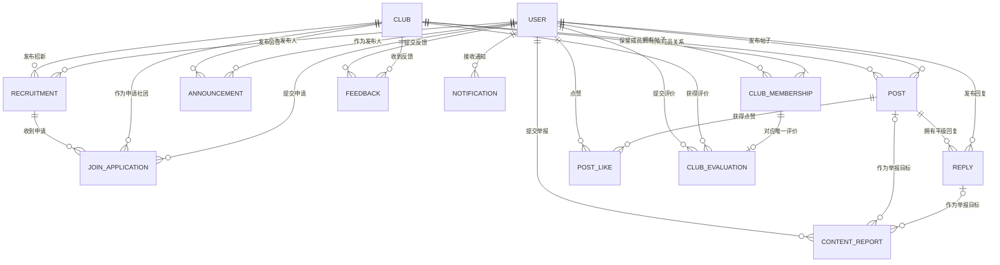

# 数据库概念设计

## 文档信息

- **文档目的**：定义需求范围内的核心实体、实体关系、关系基数和关键业务约束，为后续数据库逻辑设计提供边界。
- **唯一需求基线**：`E:\Work\Student_club\all_\需求问答-修改版(严格按要求修改).md`。
- **编写与验收依据**：`00_阶段一任务指引_供新智能体.md`。
- **权限依据**：`01_角色权限矩阵.md`。
- **状态依据**：`02_业务状态与状态流转.md`。
- **当前状态**：已通过。
- **依赖关系**：`04_数据库逻辑设计.md` 必须以本文件确定的实体、关系和约束为基础，不得自行增加业务实体或业务字段。

## 1. 设计范围与边界

### 1.1 本文件负责的内容

本文件只描述：

- 需求明确规定的业务实体；
- 实体之间的关系和基数；
- 唯一性、取值范围、历史保留和跨记录业务约束；
- 为实现已通过权限与状态规则所必需的数据边界。

本文件不提供字段类型、字段长度、索引、可执行 SQL、Django Model、迁移文件或接口设计；这些内容属于后续文档，但不得突破本文件的业务边界。

### 1.2 核心原则

1. **只保留指定实体**：第一版只设计 13 个需求实体，不增加社团分类、审计日志、AI 调用日志、附件等实体。
2. **平台角色与社团身份分离**：平台角色属于用户；负责人或普通成员身份属于用户与具体社团之间的成员关系。
3. **当前成员关系唯一**：同一用户与同一社团只保留一条成员关系，重新加入时恢复原关系，不新建第二条关系。
4. **状态只按需求保存**：只保存 `02_业务状态与状态流转.md` 明确列出的持久化状态；不为所有实体统一增加状态、更新时间或状态变更记录。
5. **历史保留不等于增加审计**：按需求保留原业务记录，但不增加统一审计实体、操作人、操作时间、变更原因、删除人、删除时间等信息。
6. **能关联查询的信息不重复保存**：负责人名单、负责人联系方式和回复所属社团等信息从已有关系读取；只有入社申请的姓名、专业班级需要保存提交时快照。
7. **AI 不形成业务数据实体**：帖子 AI 问答历史、AI 文档生成历史和 AI 调用记录均不持久化。

## 2. 实体清单与信息边界

以下 13 个实体均独立存在。表中“只承载的信息”用于限定业务字段范围，不表示本概念设计提前规定具体字段名或数据类型。

| 实体 | 核心职责 | 只承载的信息 |
|---|---|---|
| 用户 `User` | 保存登录身份、平台角色、账号状态和学生资料 | 用户 ID、用户名、密码的安全存储结果、平台角色、账号状态、注册时间、姓名、手机号、专业班级、年级 |
| 社团 `Club` | 保存社团公开资料和社团状态 | 社团 ID、唯一名称、固定枚举类别、简介、必填 Logo、创建时间、社团状态；负责人名单及联系方式不重复保存 |
| 社团成员关系 `ClubMembership` | 连接用户与社团，表示成员当前状态和该社团内身份 | 所属用户、所属社团、成员状态、社团身份；不保存加入、退出、移除的时间、操作人或原因 |
| 招新信息 `Recruitment` | 保存一次招新的内容、人数和有效时间 | 标题、简介、要求、招新人数、开始时间、结束时间、发布社团、发布人、发布时间，以及支撑负责人提前结束所必需的结束标记；不保存可独立修改的展示状态 |
| 入社申请 `JoinApplication` | 保存学生针对一次招新的申请及审核结果 | 申请人、提交时姓名快照、提交时专业班级快照、申请社团、招新信息、申请理由、申请时间、申请状态；不保存手机号快照、审核人、审核时间、审核原因或审核说明 |
| 公告 `Announcement` | 保存社团内部纯文本公告 | 标题、正文、发布社团、发布人、发布时间、是否置顶、公告状态；不保存阅读记录或删除审计信息 |
| 帖子 `Post` | 保存社团讨论板主帖 | 最多 255 字的标题、最多 5000 字的正文、所属社团、作者、是否置顶、帖子状态；不保存分类、发布时间、修改信息、任意附件或删除审计信息 |
| 回复 `Reply` | 保存直接回复帖子的平级内容 | 所属帖子、作者、最多 1000 字的回复内容、回复状态；不关联目标回复，不保存发布时间、修改信息、点赞信息或删除审计信息 |
| 帖子点赞 `PostLike` | 表示用户对帖子的当前点赞关系 | 点赞用户、被点赞帖子；不设置点赞状态 |
| 站内通知 `Notification` | 保存三类规定事件的通知 | 接收人、通知类型、展示文字；不保存已读状态、阅读时间、触发者或通用业务对象关联 |
| 社团评价 `ClubEvaluation` | 保存当前在社成员对社团的一条实名评价 | 评价用户、被评价社团、对应成员关系、一至五星评分、可选文字评价；不保存匿名标记、审核状态或删除状态 |
| 意见反馈 `Feedback` | 保存成员向所在社团提交的反馈及处理结果 | 提交人、所属社团、反馈内容、提交时间、反馈状态、可选处理说明；不保存处理人或处理时间 |
| 内容举报 `ContentReport` | 保存成员对可见帖子或回复的举报及处理结果 | 举报人、举报理由、被举报帖子或被举报回复、举报状态、处理说明；处理时说明必填，不保存内容快照、处理人、处理时间或处罚记录 |

### 2.1 固定枚举而非独立实体

社团类别固定为：

- 文化艺术；
- 体育竞技；
- 学术科技；
- 公益实践；
- 兴趣爱好；
- 其他。

第一版不建立 `ClubCategory` 实体，不设计分类维护功能。

### 2.2 明确不建立的实体

以下内容不属于第一版实体：

- 平台角色表和社团负责人表；
- 社团分类表；
- 招新展示状态表或状态变化记录；
- 公告阅读记录；
- 回复点赞或多层回复关系；
- 通知阅读记录、通知业务对象或通知跳转关系；
- 评价审核或评分统计实体；
- 用户处罚、举报内容快照或统一审计日志；
- AI 问答历史、AI 文档生成历史、AI 调用日志或 AI 配置表；
- 图片、附件、活动、活动报名、聊天、私信、在线状态、统计结果等实体。

公告图片和帖子图片属于时间允许再完善的功能，本版概念设计不预建对应实体。

## 3. 核心关系说明

### 3.1 用户、社团与成员关系

- 一个用户可以没有成员关系，也可以拥有多条分别属于不同社团的成员关系。
- 一个社团在创建时必须产生至少一条成员关系，此后可保留多条当前或历史成员关系。
- 每条成员关系只关联一个用户和一个社团。
- 用户与社团的组合在成员关系中唯一；成员退出、被移除后重新加入时更新原关系。
- 只有用户账号正常、社团正常且成员状态为在社时，成员关系才产生内部业务权限；负责人管理权限还要求社团身份为负责人。
- 正常社团必须至少存在一条“用户账号正常、成员状态为在社、社团身份为负责人”的有效负责人关系。

### 3.2 社团内容与招新

- 一个社团可以发布多条招新信息、公告和帖子。
- 每条招新信息、公告和帖子只属于一个社团，并关联一个实际发布人或作者。
- 一个帖子可以拥有多条回复；每条回复只直接关联一个帖子。
- 回复不直接保存所属社团，所属社团从父帖子确定。

### 3.3 入社申请与成员结果

- 一条招新信息可以收到多条入社申请。
- 每条申请只属于一个申请人、一个社团和一条招新信息。
- 申请关联的社团必须与招新信息所属社团一致。
- 同一学生在同一招新下不能同时存在多条待审核申请；被拒绝后只能申请该社团后续发布的新招新信息。
- 申请变为已通过时，系统创建或恢复该申请人与目标社团之间的唯一成员关系，并将其设为“在社、普通成员”。申请本身不增加成员结果外键。

### 3.4 帖子、回复与点赞

- 一个帖子可以拥有零至多条平级回复。
- 每条回复直接关联帖子，不关联另一条回复。
- 用户与帖子通过 `PostLike` 形成多对多关系。
- 同一用户对同一帖子最多存在一条点赞关系；取消点赞时移除该关系。
- 帖子被逻辑删除后，其回复自身状态不变，但全部停止向普通成员展示。

### 3.5 评价、反馈、举报与通知

- 一条评价同时关联一个用户、一个社团和该用户在该社团的唯一成员关系，三者必须一致。
- 一条成员关系最多对应一条评价；符合权限条件时，用户修改的是原评价。
- 一条反馈关联一个提交用户和一个社团。
- 一条举报关联一个举报用户，并且必须在帖子目标和回复目标中二选一。
- 举报目标所属社团从原帖子或回复关系确定，不在举报中重复保存社团。
- 一条通知只关联一个接收用户，不关联触发者、帖子、回复、申请、举报或其他通用业务对象。

## 4. Mermaid ER 图

### 4.1 图中可选关系说明

- 每条 `ContentReport` 的帖子目标和回复目标分别可以为空，但两者必须且只能有一个非空。
- `ClubEvaluation` 创建时必须有关联成员关系；一条成员关系可以没有评价，也可以有一条评价。
- `Notification` 与触发通知的业务记录没有数据库关系，通知文字只用于展示规定的处理结果。

## 5. 关系基数与完整性总表

| 主体 | 客体 | 基数与完整性要求 |
|---|---|---|
| 用户、社团 | 社团成员关系 | 多对多，经 `ClubMembership`；用户与社团组合唯一 |
| 社团 | 招新信息 | 一对多；招新所属社团在记录生命周期内不改变 |
| 招新信息 | 入社申请 | 一对多；同一申请人同一招新不能同时存在多条待审核申请 |
| 社团 | 入社申请 | 一对多；必须与申请关联招新的所属社团一致 |
| 社团 | 公告 | 一对多；公告逻辑删除后关系继续保留 |
| 社团 | 帖子 | 一对多；帖子逻辑删除后关系继续保留 |
| 帖子 | 回复 | 一对多；父帖删除不改变回复自身状态 |
| 用户、帖子 | 帖子点赞 | 多对多，经 `PostLike`；用户与帖子组合唯一 |
| 用户、社团、成员关系 | 社团评价 | 每条评价同时关联三者；每条成员关系最多一条评价 |
| 用户、社团 | 意见反馈 | 用户一对多、社团一对多；每条反馈分别只属于一个用户和一个社团 |
| 用户、帖子或回复 | 内容举报 | 每个目标可有多条举报；每条举报恰好关联一个目标 |
| 用户 | 站内通知 | 一对多；每条通知只有一个接收人 |

## 6. 关键业务约束

### 6.1 可由单条记录或键约束表达

1. 用户名全局唯一。
2. 社团类别只能取六个固定枚举值。
3. 用户与社团的成员关系组合唯一。
4. 用户与帖子的点赞关系组合唯一。
5. 每条成员关系最多对应一条社团评价。
6. 评价分数只能为一至五星。
7. 招新人数必须为正数，开始时间必须早于结束时间。
8. 公告、帖子和回复只使用各自规定的“正常、已删除”状态。
9. 通知类型只能是“有人回复了我的帖子”“我的举报已经处理”“我的入社申请已经审核”。
10. 举报必须且只能关联帖子或回复中的一个目标。

### 6.2 需要服务端联合校验

1. 成员关系中的用户必须是学生用户；社团身份不能写入用户实体。
2. 创建或修改社团时，名称必须唯一，类别只能从固定枚举中选择，Logo 必填。
3. 申请中的社团必须等于招新所属社团；姓名和专业班级在提交时从当前用户资料复制，学生不能自行填写或修改。
4. 创建申请时，申请人必须不在社，目标招新必须为进行中，且同一申请人在该招新下没有其他待审核申请。
5. 被拒绝的学生只能在该社团后续发布的新招新中重新申请。
6. 评价关联的用户、社团和成员关系必须互相一致；创建或修改时还必须满足社团正常、用户账号正常和成员在社。
7. 反馈的提交人与社团之间必须存在当前有效成员关系；从待处理变为已处理时，处理说明可选并允许为空。
8. 举报人必须对目标内容具有查看权限，目标社团从原内容确定；从待处理变为已采纳或未采纳时，处理说明必填。
9. 发布帖子时标题不得超过 255 字、正文不得超过 5000 字；发布回复时内容不得超过 1000 字。
10. 点赞、回复、举报和帖子 AI 的社团归属及可见性必须从帖子和回复本身的关系确定，不能只信任客户端传入的社团标识。

### 6.3 必须由同一业务操作和并发控制保证

1. **创建社团**：社团与至少一条“在社、负责人”成员关系必须同时创建成功；初始负责人必须是账号正常的学生。
2. **最后负责人保护**：停用账号或取消负责人身份前，必须保证操作完成后正常社团仍至少有一名有效负责人。
3. **通过入社申请**：申请仍为待审核、申请人当前不在社、招新已通过人数尚未达到招新人数；申请状态变化与成员关系创建或恢复必须同时成功。
4. **通知副作用**：回复帖子、处理举报、审核入社申请时，对应通知应与主业务操作保持一致。

### 6.4 招新展示状态

招新的“未开始、进行中、已满、已结束”是动态计算结果，不保存为可独立修改的展示状态。服务端按以下优先级判断：

1. 已被负责人提前结束，或服务端当前时间已经超过结束时间：已结束；
2. 已通过申请数大于或等于招新人数：已满；
3. 服务端当前时间早于开始时间：未开始；
4. 其他情况：进行中。

提前结束只记录支撑上述判断所需的结束事实，不增加结束操作人、操作时间或原因。招新结束后不能修改或恢复，但仍可审核结束前已经提交的待审核申请；已满时不能继续通过申请。

## 7. 历史保留与删除边界

1. 用户停用只改变账号状态，不删除用户或其历史业务记录。
2. 社团注销只改变社团状态，不批量修改成员、招新、申请、公告、帖子、回复、评价、反馈或举报的状态。
3. 成员退出、被移除或重新加入均更新同一条成员关系；不创建成员变更历史实体。
4. 公告、帖子和回复通过规定状态实现逻辑删除，不增加删除人、删除时间或删除原因。
5. 帖子被删除后，回复继续保留且自身状态不变。
6. 举报继续关联原帖子或回复；原内容逻辑删除后不需要保存举报快照。
7. 取消帖子点赞时可以移除 `PostLike` 关系。
8. 其他实体不设计需求以外的删除功能、恢复功能或定期物理清理任务。
9. 核心业务关系不得因父记录状态变化而级联物理删除。

## 8. 数据隐私边界

| 数据 | 存储位置 | 边界 |
|---|---|---|
| 用户当前手机号 | `User` | 学生本人和系统管理员可查看；负责人只在成员管理中查看自己负责社团的当前在社成员手机号 |
| 申请姓名和专业班级快照 | `JoinApplication` | 从提交时用户资料复制；本人、系统管理员和对应社团负责人按权限查看 |
| 入社申请手机号快照 | 不存储 | 负责人查看申请时也不展示手机号 |
| 被举报内容快照 | 不存储 | 通过逻辑删除后的原帖子或回复查看历史内容 |
| AI 问题、上下文、回答和文档草稿 | 不存储 | 仅在单次请求中使用 |

## 9. 功能到实体映射

| 功能模块 | 主要实体 | 说明 |
|---|---|---|
| 注册、登录、资料与账号状态 | `User` | 不另建资料、角色或账号状态历史实体 |
| 社团创建、资料、负责人和成员管理 | `Club`, `ClubMembership`, `User` | 固定类别直接保存在社团；负责人由成员关系确定 |
| 招新与入社申请 | `Recruitment`, `JoinApplication`, `ClubMembership`, `Notification` | 展示状态动态计算；通过申请时创建或恢复成员关系 |
| 公告 | `Announcement` | 纯文本、置顶、逻辑删除；无阅读记录 |
| 讨论板 | `Post`, `Reply`, `PostLike`, `Notification` | 平级回复、帖子点赞；无帖子分类和回复点赞 |
| 社团评价 | `ClubEvaluation`, `ClubMembership`, `User`, `Club` | 实名评价，一条成员关系最多一条 |
| 意见反馈 | `Feedback` | 对应社团负责人处理，处理说明可选 |
| 内容举报 | `ContentReport`, `Post`, `Reply`, `Notification` | 帖子或回复二选一，不保存内容快照 |
| 帖子 AI 与 AI 文档助手 | 无新增实体 | 不持久化 AI 历史或调用记录，不自动发布或修改业务记录 |
| 数据概览 | 上述业务实体 | 按需求规定的指标实时统计，不保存统计结果；负责人帖子数只统计正常帖子 |

## 10. 已确认约束与第一版边界

### 10.1 社团名称唯一性

用户于 2026-07-28 确认社团名称唯一。`Club` 必须对名称建立唯一约束，创建和修改社团时均需校验重名。

### 10.2 帖子与回复最大长度

用户于 2026-07-28 确认帖子标题最多 255 字、帖子正文最多 5000 字、回复内容最多 1000 字。数据库存储类型、API 校验和页面校验必须使用相同上限。

### 10.3 可选图片能力

公告图片和帖子图片属于时间允许再完善的功能。未收到实施决定前，不增加图片字段、图片实体、上传关系或数量与大小约束。

## 11. 概念设计验收核对

- [x] 只保留任务指引指定的 13 个业务实体。
- [x] 社团类别使用固定枚举，不建立 `ClubCategory` 实体。
- [x] 平台角色位于用户，社团身份位于成员关系。
- [x] 用户与社团通过唯一成员关系形成多对多关系。
- [x] 创建社团与最后负责人保护具有明确的跨记录约束。
- [x] 招新展示状态动态计算，提前结束只保留必要事实。
- [x] 入社申请保存姓名和专业班级快照，不保存手机号或审核审计字段。
- [x] 公告、帖子和回复只保留需求规定的逻辑删除状态，不增加删除审计字段。
- [x] 回复平级且只关联帖子；第一版仅支持帖子点赞。
- [x] 评价同时关联用户、社团和成员关系。
- [x] 反馈处理说明可选、举报处理说明必填，且均不增加处理人或处理时间。
- [x] 通知只保存接收人、三类规定通知类型和展示文字。
- [x] 不建立统一审计、AI 调用、通知阅读、附件或统计结果实体。
- [x] 已按用户决定明确社团名称唯一性和帖子、回复长度；可选图片能力仍未加入第一版。
